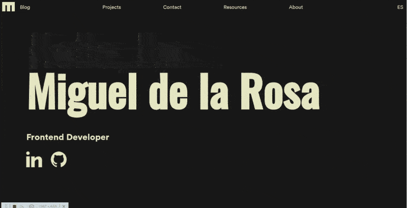

# DEVACRAN PORTFOLIO

This is a portfolio website designed by me, to show my projects and my work as Frontend developer.

**Site:** [devacran.vercel.app](https://devacran.vercel.app)

# ☄Getting Started

To run this project locally:

**Linux & npm**

1. Clone this repo `$ git clone https://github.com/devacran/Personal-Portfolio.git`
2. Enter to the folder `$ cd ./Personal-Portfolio`
3. Install dependencies `$ npm i`
4. Run development enviroment`$ npm run start`

# 🐬Deployment

This project has deployed with Vercel

# 📰 License

The MIT Licence (MIT)

# 👨‍🍳Contributing

If you want to contribute with this project, just make a Pull Request explaining the improving.

# 🖥 Ingredients

- Javascript
- Pug JS
- Stylus
- Glide JS
- Webpack
- Babel
